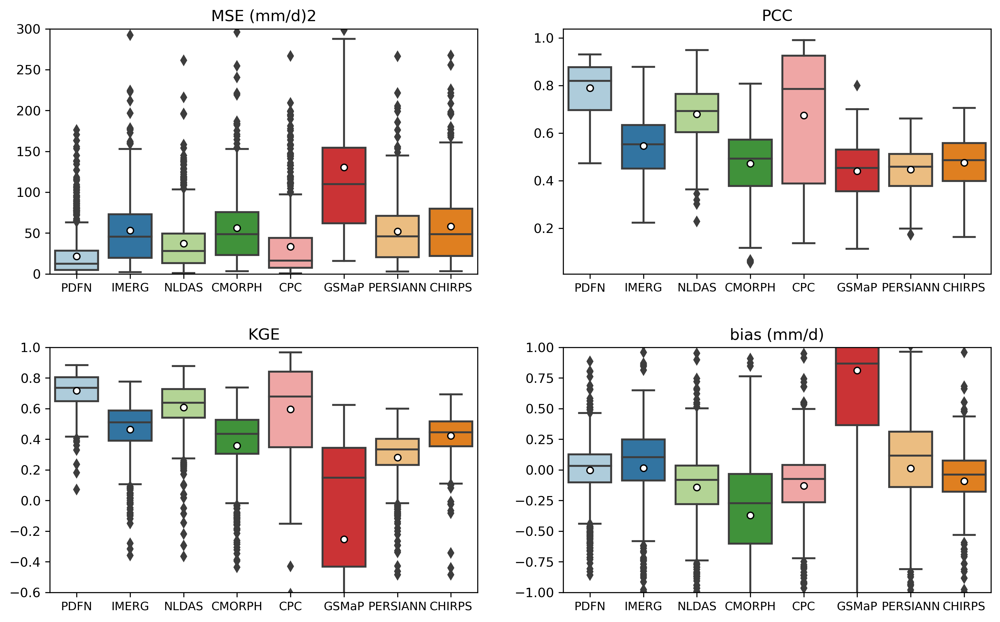
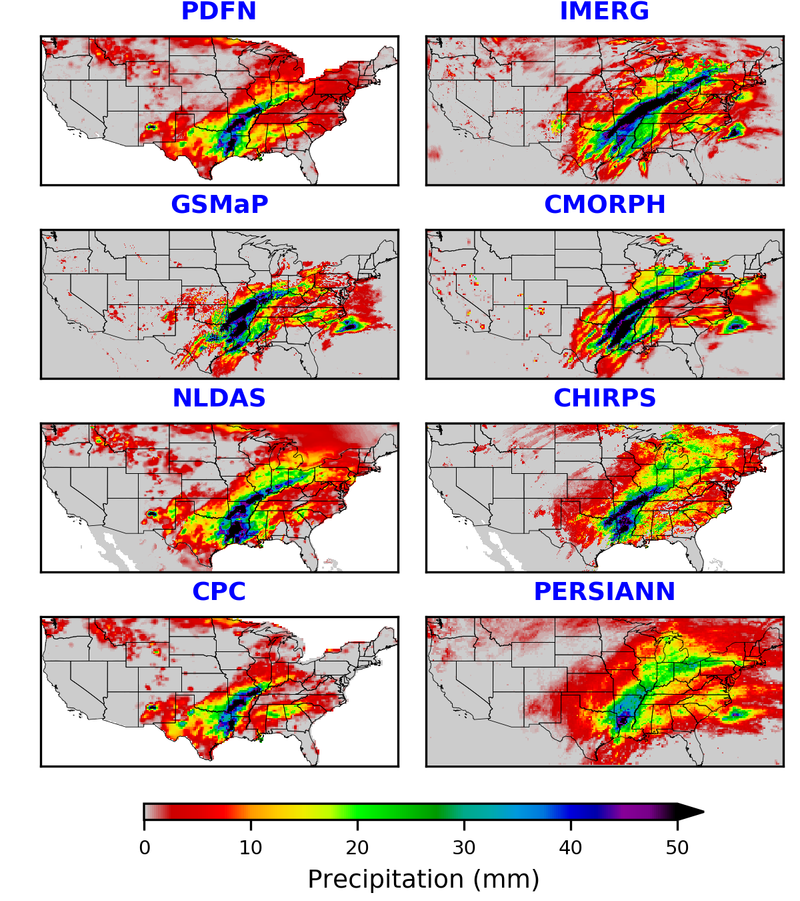

# PrecipitationFusion
 

 This repository contains codes for the paper entitled <a href="https://www.sciencedirect.com/science/article/pii/S0034425723002742?via%3Dihub#f0025)" target="_blank">"A deep learning-based framework for multi-source precipitation fusion"</a> published in Remote Sensing of Environment Journal. The paper was authored by Keyhan Gavahi, Ehsan Foroumandi, and Hamid Moradkhani. In this paper, we proposed a DL framework for multi-source precipitation data fusion and developed a fused product, PDFN, that improved the accuracy by 30%.

